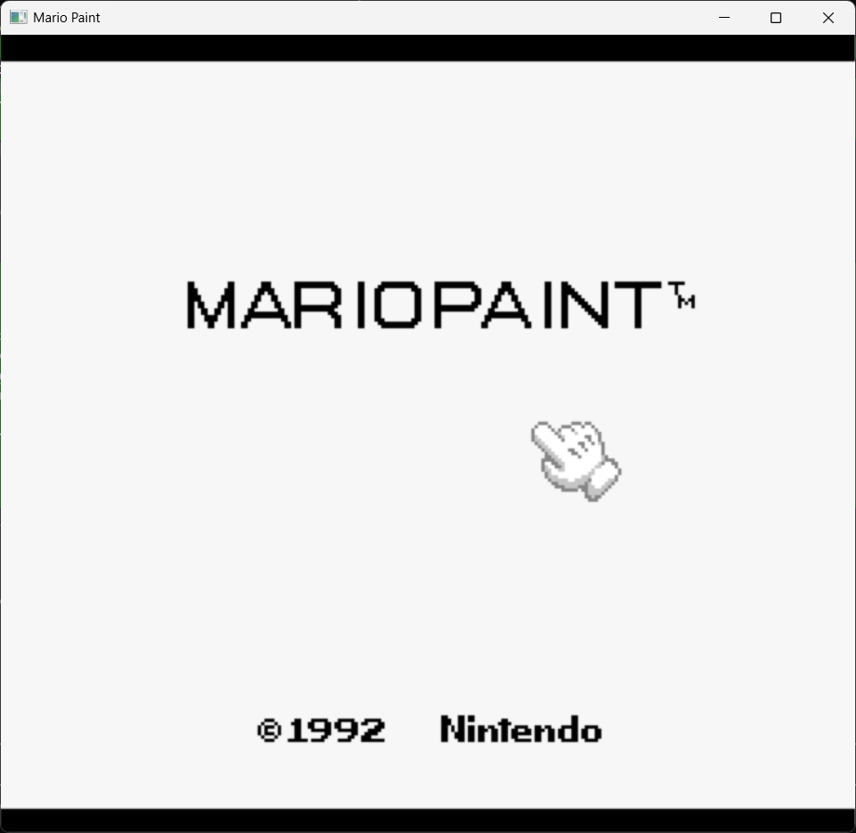

# Mario Paint Recomp

**A native PC port of Mario Paint (SNES, 1992) via static recompilation.**

You know what's cooler than emulating Mario Paint? *Running it natively.*

This project takes the original 65816 machine code from Mario Paint and converts it into equivalent C code that runs directly on your CPU — no emulator in the loop. The SNES hardware (PPU, SPC700 audio, DMA) is provided by [snesrecomp](https://github.com/sp00nznet/snesrecomp), which wraps a real SNES hardware backend. The result is Mario Paint running as a first-class native application.

```
 ╔══════════════════════════════════════════════════════╗
 ║  MARIO PAINT                           _ _          ║
 ║                                       |   |  click  ║
 ║  ┌──────────────────────────────────┐  | o |  click  ║
 ║  │                                  │  |   |  click  ║
 ║  │     your masterpiece goes here   │  |___|         ║
 ║  │                                  │   SNES         ║
 ║  │          (now in native C)       │   Mouse        ║
 ║  │                                  │  (now SDL2)    ║
 ║  └──────────────────────────────────┘                ║
 ║  [pencil] [fill] [stamp] [eraser] [undo] [music]    ║
 ╚══════════════════════════════════════════════════════╝
```



## Why Mario Paint?

Because it's a weird, wonderful game that nobody expected to be recompiled:

- **The SNES Mouse.** Mario Paint was *the* killer app for the SNES Mouse peripheral. This project maps your real PC mouse to the SNES Mouse protocol, so every click and drag works exactly like it did in 1992 — but without the mouse ball getting gunked up.

- **Mario Paint Composer.** The music composition tool spawned an entire internet subculture. Thousands of covers, remixes, and original compositions have been made with it. Now it runs natively on your PC with real SPC700 audio.

- **Gnat Attack.** The hidden flyswatter minigame that was better than most full-price games. Swat those flies with your newly-nativized mouse.

- **It's a creativity tool, not just a game.** Drawing, animation, stamps, music — Mario Paint was a multimedia suite before multimedia suites were cool.

## Status

**Active recompilation** — 161 functions recompiled across 16 source files. Complete game flow from boot through title screen to canvas mode with full drawing toolset: pencil, line, rectangle, ellipse, fill, stamp, spray can, undo, palette selection, and pixel-level 4BPP canvas manipulation.

### What works
- Full boot chain: reset vector → hardware init → title screen → canvas mode → main loop
- Title screen: palette/tile DMA, sprite animation, fade in/out, input wait
- SPC700 audio: IPL upload protocol, 4-channel command queues, per-frame NMI processing
- NMI handler with OAM/VRAM/palette DMA transfers
- PPU register mirror writeback (all display registers) + BG1-4 scroll
- HDMA setup (3 channels: windows, BG2 vertical/horizontal scroll)
- Frame sync driven by the game's own `$01E2CE` routine
- SNES Mouse input via snesrecomp API (displacement + buttons)
- Cursor movement with screen bounds clamping
- Cursor sprite rendering (reads frame data from ROM, animated cursors)
- Sprite animation engine (multi-sprite objects, flip, palette override)
- Game logic dispatch with toolbar show/hide timer
- Post-logic state machine (31-entry jump table)
- Full palette loading from ROM to CGRAM (all 256 colors)
- Tile/sprite graphics DMA from ROM to VRAM (6+ transfers)
- Tilemap generation and DMA queuing for BG1/BG2/BG3
- Canvas tilemap builders (standard + alternate pages)
- Fade-in/fade-out brightness effects
- Tool mode transitions (bomb icon animation)
- Pen graphics loading from ROM + SRAM
- SRAM checksum validation
- Palette row and display state initialization

### Recompilation progress
| Area | Functions | Source File |
|------|-----------|-------------|
| Boot/System | 9 | `mp_boot.c` |
| DMA/PPU Engine | 22 | `mp_bank01.c` |
| Input/Cursor | 7 | `mp_input.c` |
| Game Logic | 5 | `mp_gamelogic.c` |
| Graphics Init | 12 | `mp_gfxinit.c` |
| Sprite Engine | 3 | `mp_sprites.c` |
| Canvas/UI | 5 | `mp_canvas.c` |
| Audio Engine | 11 | `mp_audio.c` |
| Title Screen | 2 | `mp_title.c` |
| Boot Helpers | 13 | `mp_helpers.c` |
| Title Loop/Demo | 12 | `mp_titleloop.c` |
| Drawing Tools | 16 | `mp_tools.c` |
| Drawing Core | 9 | `mp_draw.c` |
| Miscellaneous | 11 | `mp_misc.c` |
| Shapes | 15 | `mp_shapes.c` |
| **Total** | **161** | |

### What's next
- Sprite animation engine (`$01962C`, `$01FA68`, `$01F91E`)
- Canvas tilemap builders
- Drawing tool click handlers
- SPC700 audio upload and playback
- Title screen / tool screens
- Music composer
- Gnat Attack minigame

## Building

### Prerequisites
- CMake 3.16+
- A C17 compiler (MSVC 2022, GCC, Clang)
- SDL2 (via vcpkg on Windows, or your system package manager)

### Build

```bash
git clone --recursive https://github.com/sp00nznet/mariopaint.git
cd mariopaint

# Windows (MSVC + vcpkg)
cmake -B build -G "Visual Studio 17 2022" -A x64 \
  -DCMAKE_TOOLCHAIN_FILE=C:/vcpkg/scripts/buildsystems/vcpkg.cmake
cmake --build build --config Debug

# Linux / macOS
cmake -B build && cmake --build build
```

### Run

```bash
./build/Debug/mp_launcher "path/to/Mario Paint (JU).sfc"
```

You'll need to supply your own ROM file. We don't distribute copyrighted material.

## How it works

### Static Recompilation

Instead of interpreting SNES instructions one-by-one (like an emulator), we translate the entire game into equivalent C code ahead of time:

```
Original 65816:                    Recompiled C:

LDA #$80          ──────────►     op_lda_imm8(0x80);
STA $2100                         op_sta_abs8(0x2100);
                                  // writes to real PPU via LakeSnes
```

The recompiled code calls into [snesrecomp](https://github.com/sp00nznet/snesrecomp), which provides real SNES hardware emulation (LakeSnes) as a linkable library. PPU writes update real PPU state. APU writes go to a real SPC700. DMA transfers move real data. You get authentic behavior without writing a single line of hardware emulation.

### The Mouse Problem (solved!)

Mario Paint was designed for the SNES Mouse — a serial device that sends 32-bit position/button data through the controller port. Most emulators handle this internally, but for static recompilation we needed to:

1. **Track SDL2 mouse events** — accumulate motion deltas each frame
2. **Encode SNES Mouse protocol** — pack buttons, sensitivity, and displacement into the 32-bit serial format
3. **Feed it into LakeSnes** — populate auto-joypad registers and handle manual serial reads from `$4016`

The result: your PC mouse becomes an SNES Mouse. Move it, click it, draw with it — the recompiled Mario Paint code reads the same registers and gets the same data format as the original hardware.

## Project Structure

```
mariopaint/
├── CMakeLists.txt          # Build configuration
├── CLAUDE.md               # Technical design doc
├── README.md               # You are here
├── include/mp/
│   ├── cpu_ops.h           # 65816 instruction helpers
│   └── functions.h         # Recompiled function declarations
├── src/
│   ├── main/main.c         # Entry point (launches full boot chain)
│   └── recomp/
│       ├── mp_boot.c       # Bank 00 boot chain + NMI + main loop
│       ├── mp_bank01.c     # Bank 01 DMA/PPU/system helpers
│       ├── mp_input.c      # Mouse input + cursor + animations
│       ├── mp_gamelogic.c  # Game logic dispatch + cursor rendering
│       └── mp_gfxinit.c    # Palette/tile/tilemap loading from ROM
└── ext/
    └── snesrecomp/         # SNES hardware backend (submodule)
```

## Related Projects

- **[snesrecomp](https://github.com/sp00nznet/snesrecomp)** — The SNES hardware library that makes this possible
- **[Super Mario Kart Recomp](https://github.com/sp00nznet/mk)** — Sister project, same architecture
- **[Mario Paint Disassembly](https://github.com/Yoshifanatic1/Mario-Paint-Disassembly)** — Full 65816 disassembly (reference)
- **[LakeSnes](https://github.com/angelo-wf/LakeSnes)** — The SNES emulator powering the hardware backend

## Contributing

This is an active recompilation effort. The main work is translating 65816 assembly into C functions using the cpu_ops helpers. If you're familiar with SNES assembly or have experience with game reverse engineering, contributions are welcome!

## License

MIT — see [LICENSE](LICENSE).

The original Mario Paint is (c) 1992 Nintendo. This project does not include any copyrighted game data. You must supply your own legally obtained ROM file.
