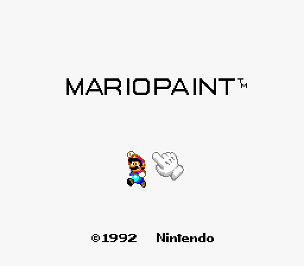
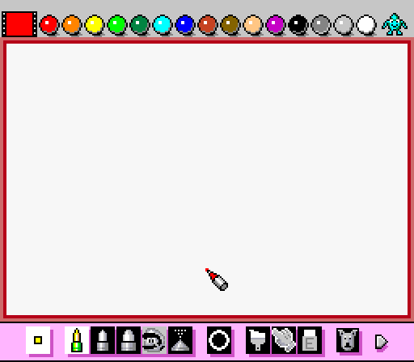
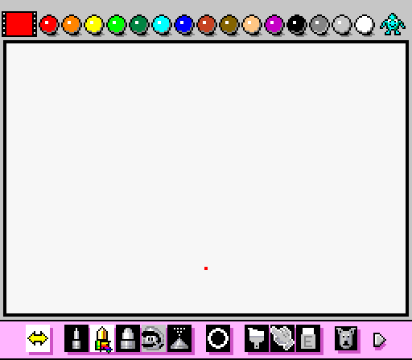

# Mario Paint Recomp

A native PC port of Mario Paint (SNES, 1992) by static recompilation: the game's
65816 routines are translated to C and run on your CPU, with the SNES hardware
(PPU, SPC700 audio, DMA, the SNES Mouse) supplied by
[snesrecomp](https://github.com/sp00nznet/snesrecomp).

Part of the sp00nznet recomp family and follows its shared house style (layout,
CLI flags, headless harness, conformance reporting); see snesrecomp for the
toolkit. The toolkit changes this build needs are in review as snesrecomp
#1-#5 and LakeSnes #1; the submodule pins their branch.

## Status

**Alpha. Unversioned.** The title screen, the canvas, and every bottom-bar
button work. In the last end-to-end check every screen of the scripted tour was
pixel-identical to the genuine ROM except the eraser's bomb icon; that routine
has been fixed and passes conformance since, but the tour has not been re-run
end to end. They work because the default mode runs the
genuine ROM in a cycle-timed loop and swaps in recompiled C only for routines
proven correct; the rest still runs on the emulated CPU.

**Conformance: 57 / 103** hand-ported routines reached by the canvas tour
match the ROM on every checked call (WRAM, VRAM, CGRAM, OAM, I/O registers;
`tools/conformance.py`, baseline in `tools/conformance_baseline.txt`). Those 57
run natively by default; the other 46 hand-ports are known wrong and the genuine
routine runs instead. The tour executes 135 distinct `JSR`/`JSL` targets, so
most of the game is still genuine code.

**Generated code: experimental.** snesrecomp's new generator lifts 111 of the
119 routines the tour reaches (`tools/gen.py`, output in gitignored `gen/`).
It builds and reaches the title screen; no conformance run over it has finished
yet, so it is off unless you set `MP_GEN=1`.

| Area | State |
|---|---|
| Boot, SPC700 upload, title screen | Plays; boot and title routines mostly genuine |
| Mouse | Native, translated from the ROM (`$01:D9E1`, `$00:8B48`); cursor locked to the host pointer |
| Canvas, toolbars, tool switching | Plays; toolbar logic mostly genuine, several hand-ports fail conformance |
| Drawing, stamps, undo | Not covered by the tour yet |
| Music Composer, Gnat Attack, animation | Reachable, not covered by the tour yet |

Generated source is not distributed. Recompiler output, disassembly, and
anything else derived from the ROM stay on your machine (`gen/`, `scratch/`);
you supply your own ROM.

## Screenshots

Real output from the default build, captured headlessly by `tools/canvas_tour.py`.

| Title | Canvas | Tool switched from the bottom bar |
|---|---|---|
|  |  |  |

## Getting Started

### Quick start

Not available yet: a double-click `Setup.cmd` is on the [roadmap](ROADMAP.md).
Use the step-by-step route.

### Step by step (Windows)

Prerequisites:

| Tool | Version | Notes |
|---|---|---|
| Visual Studio 2022 | 17.x, "Desktop development with C++" | MSVC is the primary compiler |
| CMake | 3.16+ | `cmake --version` |
| vcpkg | any recent | at `C:\vcpkg`, or pass your own toolchain path |
| Git | any | for the submodules |
| Python | 3.10+ with Pillow | only for the harness tools (`py -m pip install pillow`) |
| ffmpeg | any | only for `--record` |

1. Install SDL2 and SDL2_ttf:
   ```
   C:\vcpkg\vcpkg install sdl2:x64-windows sdl2-ttf:x64-windows
   ```
2. Clone with submodules:
   ```
   git clone --recursive https://github.com/sp00nznet/mariopaint.git
   cd mariopaint
   ```
   Already cloned without `--recursive`? `git submodule update --init --recursive`.
3. Configure and build:
   ```
   cmake -B build -DCMAKE_TOOLCHAIN_FILE=C:/vcpkg/scripts/buildsystems/vcpkg.cmake
   cmake --build build --config Release
   ```
   The last line of the build is
   `mp_launcher.vcxproj -> ...\build\Release\mp_launcher.exe`.
4. Put your own dump next to it. The expected file is *Mario Paint (Japan, USA)*,
   LoROM, 1 MB (`.sfc` or headered `.smc`).
5. Run:
   ```
   build\Release\mp_launcher.exe "Mario Paint (JU) [!].smc"
   ```
   The console prints `Mario Paint recomp: timed recomp (verified functions native)`
   and the window opens on the title screen. Click Mario as he walks past to
   reach the canvas.

Usual trip-ups: `py` vs `python` (the harness uses `py`); the Microsoft Store
`python` alias shadowing a real install; a new terminal after installing CMake or
ffmpeg so `PATH` picks them up; a missing SDL2 DLL means the vcpkg triplet did
not match (`x64-windows`).

## Usage

```
mp_launcher [--headless] [--record out.mp4] <rom>
```

- Mouse: the SNES Mouse; the in-game cursor stays locked to your pointer.
- F12 screenshot, F5/F8 save/load state, Esc quits, menu bar for video/audio.
- `--headless`: no window, no audio, runs as fast as possible. `--record out.mp4`
  also pipes every frame to ffmpeg.

Modes (environment variables; see [docs/architecture.md](docs/architecture.md)):

| Variable | Effect |
|---|---|
| (none) | Timed recomp: genuine timing, verified routines native |
| `MP_REALFRAME=1` | Genuine ROM only, no native code (the reference) |
| `MP_NATIVE=1` | The older native-driven boot chain (hand-ports, untimed interpreter fallback) |
| `MP_TIMED=01D9E1L,...` | Run exactly these natively |
| `MP_VALIDATE=...` | Lockstep-validate these against the ROM |
| `MP_PROFILE=N` | Dump the N hottest call targets at exit |
| `MP_GEN=1` | Use generated routines from `gen/` (experimental, unvalidated) |

Harness (needs the ROM; output in `scratch/`):

```
py tools/canvas_tour.py "Mario Paint (JU) [!].smc" [--real]
py tools/conformance.py "Mario Paint (JU) [!].smc"
```

Details in [docs/harness.md](docs/harness.md).

## Building from source

The steps above are the build. Layout:

```
src/main/main.c       modes, mouse setup, the verified list
src/recomp/mp_*.c     recompiled routines (mp_XXXXXX = SNES address)
include/mp/           declarations
tools/                headless tour, conformance, bisect, gen.py (Python)
gen/                  generated from your ROM by tools/gen.py (gitignored)
docs/                 architecture, harness notes, reference captures
ext/snesrecomp        toolkit submodule (LakeSnes inside)
```

Linux and macOS builds are untested.

## Documentation

- [docs/architecture.md](docs/architecture.md) — modes and why the timed model
- [docs/harness.md](docs/harness.md) — headless runs, scripted mouse, conformance
- [docs/ref/README.md](docs/ref/README.md) — reference captures from the real game
- [CHANGELOG.md](CHANGELOG.md), [ROADMAP.md](ROADMAP.md), [CONTRIBUTING.md](CONTRIBUTING.md)

## Contributors

No outside contributions yet. See [CONTRIBUTING.md](CONTRIBUTING.md).

## License

MIT, see [LICENSE](LICENSE). Mario Paint is © Nintendo; no part of it is
included here.
